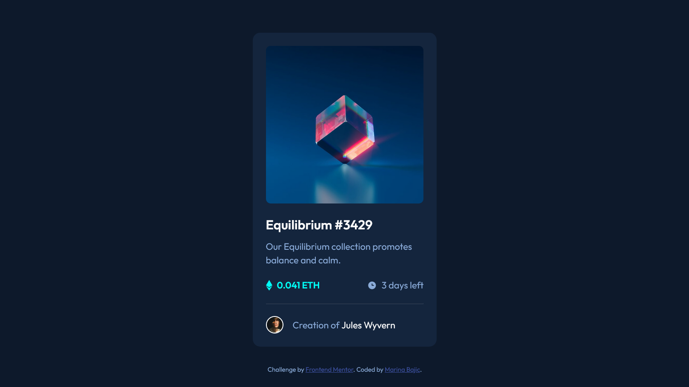
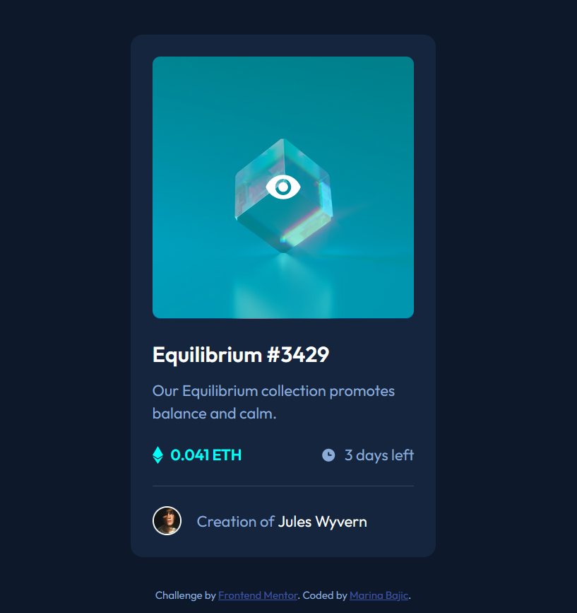

# Frontend Mentor - NFT preview card component solution

This is a solution to the [NFT preview card component challenge on Frontend Mentor](https://www.frontendmentor.io/challenges/nft-preview-card-component-SbdUL_w0U). Frontend Mentor challenges help you improve your coding skills by building realistic projects. 

## Table of contents

- [Overview](#overview)
  - [The challenge](#the-challenge)
  - [Screenshot](#screenshot)
  - [Links](#links)
- [My process](#my-process)
  - [Built with](#built-with)
  - [What I learned](#what-i-learned)
  - [Continued development](#continued-development)
  - [Useful resources](#useful-resources)
- [Author](#author)
- [Acknowledgments](#acknowledgments)

## Overview

### The challenge

Users should be able to:

- View the optimal layout depending on their device's screen size
- See hover states for interactive elements

### Screenshot




### Links

- Solution URL: [Add solution URL here](https://your-solution-url.com)
- Live Site URL: [frontend-mentor-nft-preview-card-component-marina.vercel.app](https://frontend-mentor-nft-preview-card-component-marina.vercel.app/)

## My process

### Built with

- Semantic HTML5 markup
- CSS custom properties
- Flexbox
- Positions
- Mobile-first workflow

### What I learned

How to put color over an image (the non-complicated way):

```html

<div class="on-hover">
  
</div>
```
```css
.on-hover {
  height: 50.1%;
  width: calc(100% - 2.8em);
  border-radius: calc($border-radius - 0.3em);
  position: absolute;
  display: flex;
  justify-content: center;
  align-items: center;

  img {
    width: 2.5em;
    height: 2.5em;
    visibility: hidden;
  }
}

.on-hover:hover {
  cursor: pointer;
  background: $cyan-transparent;

  img {
    visibility: visible;
  }
}
```

## Author

- Website - [Marina Bajic](https://marinabajic.github.io/)
- Frontend Mentor - [@MarinaBajic](https://www.frontendmentor.io/profile/MarinaBajic)
